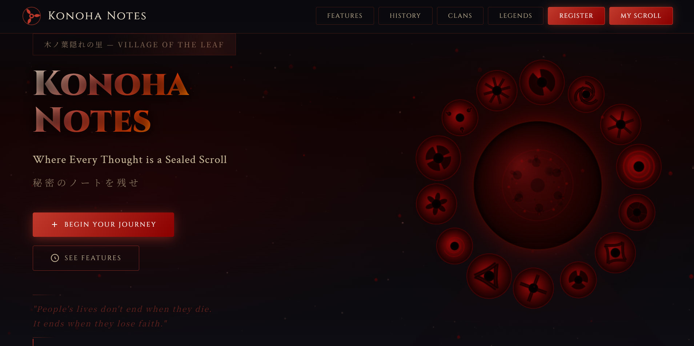
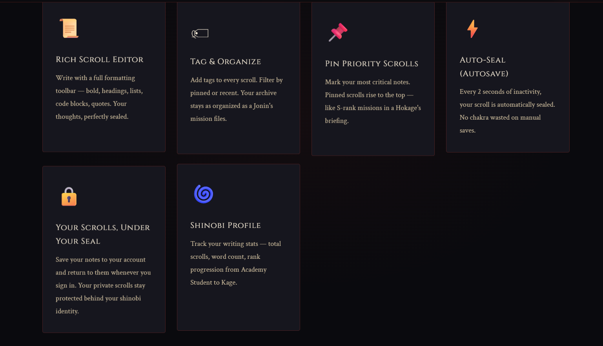
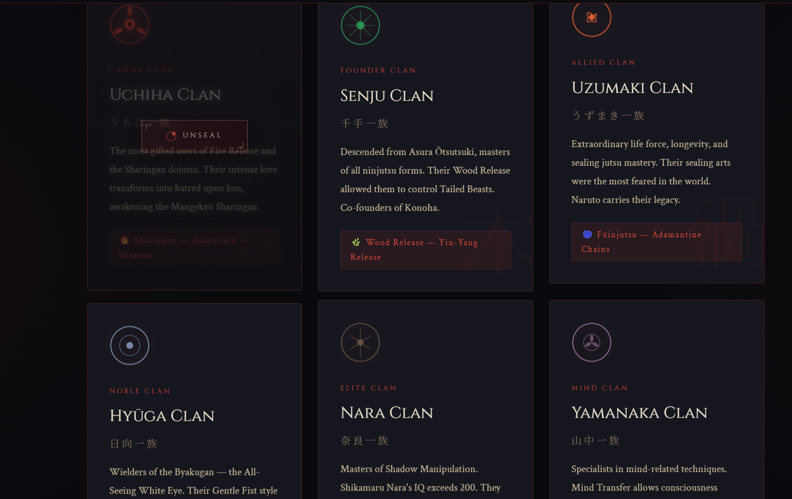
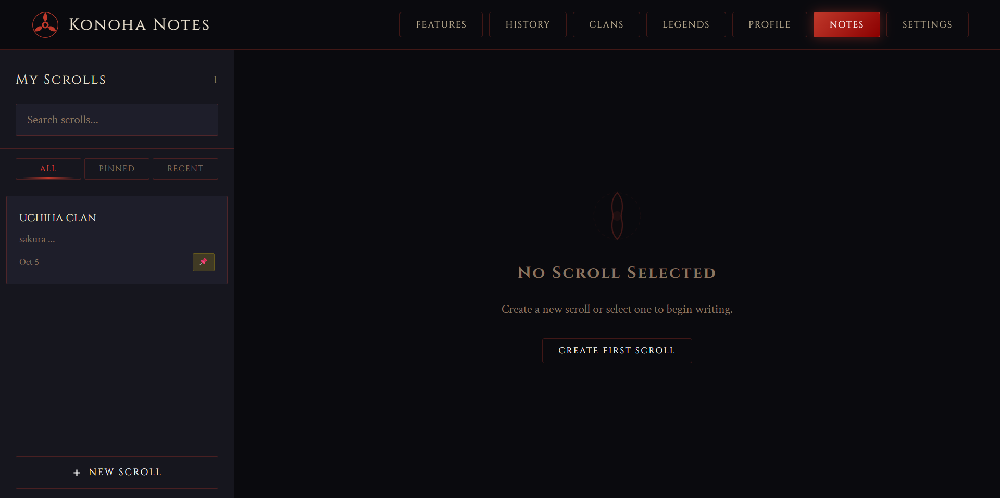
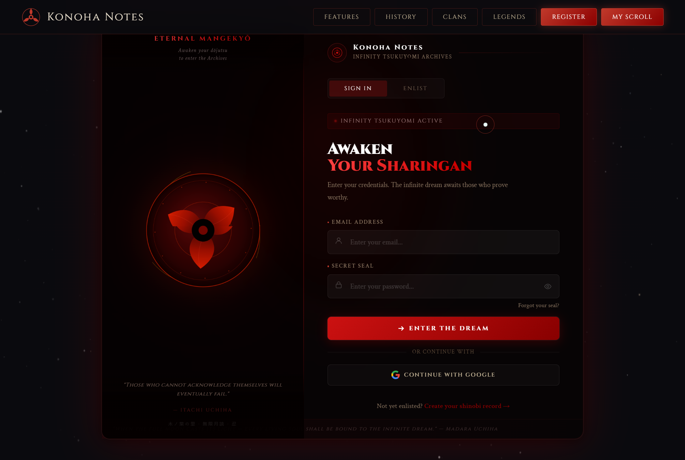
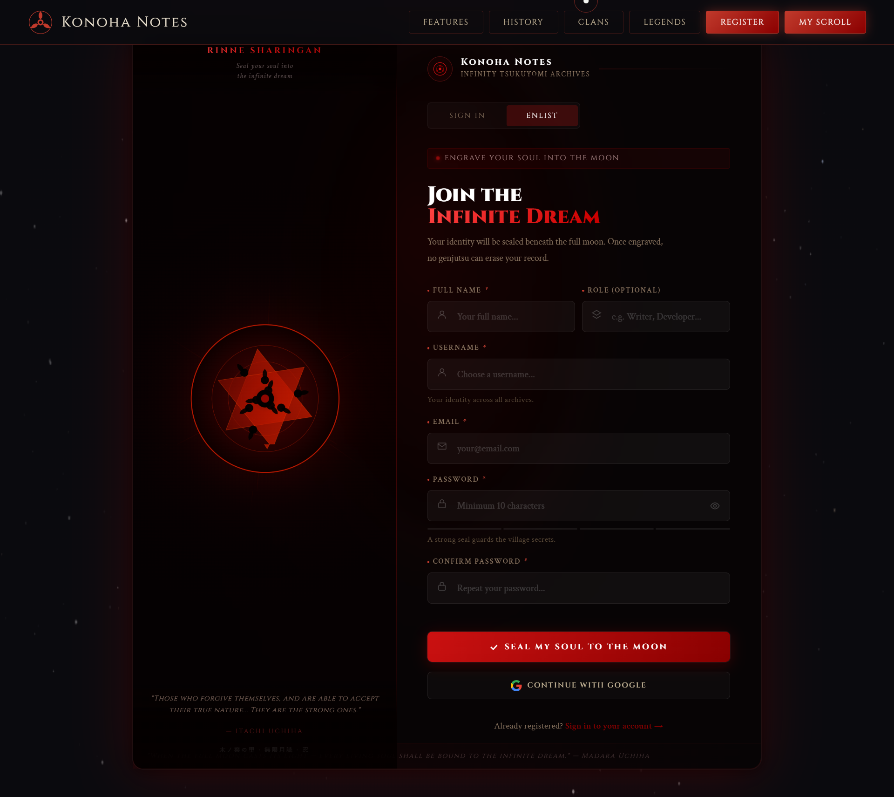
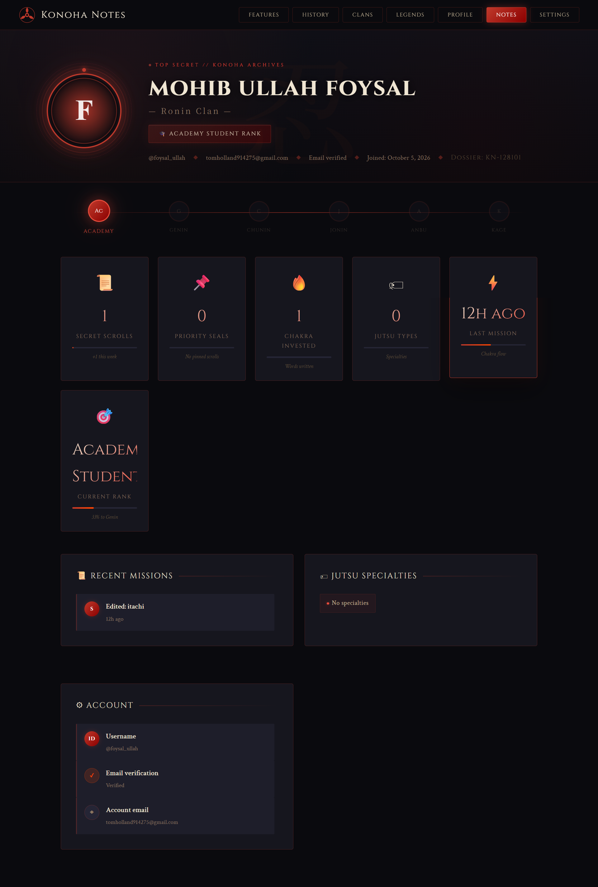
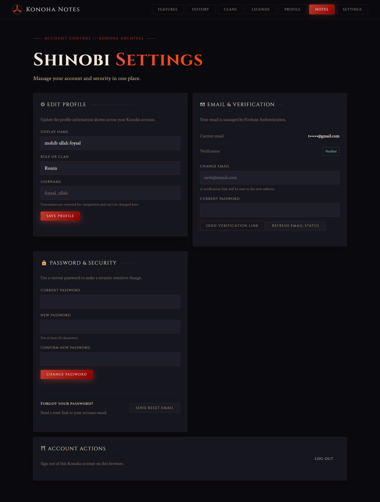

# 🍃 Konoha Notes

A Naruto-themed personal notes application built around a custom cinematic interface, Firebase Authentication, and private Cloud Firestore storage.

The application uses plain HTML, CSS, and modular JavaScript without a UI framework or application server. The original visual design is preserved while the application logic has been organized around a feature-based architecture.

> **Project Status:** Local development and the main application flows have been verified. Unit tests, Firestore Security Rules emulator tests, JavaScript syntax checks, and browser smoke testing are passing. Production Firebase Hosting deployment is not yet verified.

---

## ✨ Features

### 🔐 Authentication

* Email/password registration
* Email verification
* Verified-email login
* Password reset
* Verification email resend
* Google popup sign-in
* Firebase Auth persistence
* Protected application routes
* Guest/public navigation
* Logout and authenticated-state handling
* Unique username registration

### 📝 Notes

* Create notes
* Read notes
* Edit notes
* Delete notes
* Rich-text note content
* Tags
* Pin/unpin notes
* Search
* Pinned/recent filters
* Pinned-first/recent sorting
* Persistent Firestore storage
* User-specific note isolation

### 👤 Profile

* Firebase user information
* Username
* Clan information
* Profile statistics
* Note-derived activity information

### ⚙️ Settings

* Account management
* Authentication-related actions
* Password reset
* Logout
* Application management

### 🛡️ Security

* Firebase Authentication
* UID-based Firestore ownership
* Verified-email requirement for notes
* Private username claims
* Cross-user access protection
* Immutable user ownership
* Protected timestamps
* Firestore field validation
* Client-side HTML sanitization
* No application password/session storage

---

## 🖥️ Screenshots

The following screenshots were captured from the current Konoha Notes application.

### Home

<table>
  <tr>
    <td width="50%" align="center">
      
      <br><br>
      <strong>Hero & Navigation</strong>
    </td>
    <td width="50%" align="center">
      
      <br><br>
      <strong>Features</strong>
    </td>
  </tr>
  <tr>
    <td width="50%" align="center">
      
      <br><br>
      <strong>Clans</strong>
    </td>
    <td width="50%" align="center">
      
      <br><br>
      <strong>Shinobi / Story</strong>
    </td>
  </tr>
</table>

### Application

<table>
  <tr>
    <td width="50%" align="center">
      
      <br><br>
      <strong>My Scroll</strong>
    </td>
    <td width="50%" align="center">
      
      <br><br>
      <strong>Notes Dashboard</strong>
    </td>
  </tr>
  <tr>
    <td width="50%" align="center">
      
      <br><br>
      <strong>Login</strong>
    </td>
    <td width="50%" align="center">
      
      <br><br>
      <strong>Sign In / Registration</strong>
    </td>
  </tr>
  <tr>
    <td width="50%" align="center">
      
      <br><br>
      <strong>Profile</strong>
    </td>
    <td width="50%" align="center">
      
      <br><br>
      <strong>Settings</strong>
    </td>
  </tr>
</table>

> Mobile-specific screenshots can be added later when available.

---

## 🧰 Technology Stack

| Category           | Technology                                    |
| ------------------ | --------------------------------------------- |
| Frontend           | HTML5, CSS3, JavaScript                       |
| Architecture       | Feature-based / Clean Architecture principles |
| Authentication     | Firebase Authentication                       |
| Database           | Cloud Firestore                               |
| SDK                | Firebase JavaScript SDK 12.19.0               |
| Hosting            | Firebase Hosting                              |
| Testing            | Node.js Test Runner                           |
| Security Testing   | Firebase Rules Unit Testing                   |
| Local Development  | Firebase Emulator Suite                       |
| Package Management | npm                                           |
| Version Control    | Git / GitHub                                  |

No frontend UI framework is used.

---

## 🏗️ Architecture

The application follows a feature-based architecture inspired by Clean Architecture.

```text
Presentation
     ↓
  Domain
     ↓
    Data
```

The domain layer remains independent from Firebase-specific implementation details.

### Project Structure

```text
konoha_nots/
│
├── public/
│   ├── index.html
│   │
│   ├── assets/
│   │   ├── css/
│   │   │   └── app.css
│   │   │
│   │   ├── js/
│   │   │   └── legacy-ui.js
│   │   │
│   │   └── images/
│   │       └── ...
│   │
│   ├── firebase/
│   │   ├── firebase-config.js
│   │   └── firebase-config.example.js
│   │
│   └── src/
│       ├── core/
│       │   ├── config/
│       │   ├── errors/
│       │   ├── services/
│       │   └── utils/
│       │
│       ├── features/
│       │   ├── auth/
│       │   │   ├── data/
│       │   │   ├── domain/
│       │   │   └── presentation/
│       │   │
│       │   ├── notes/
│       │   │   ├── data/
│       │   │   ├── domain/
│       │   │   └── presentation/
│       │   │
│       │   └── profile/
│       │       └── domain/
│       │
│       └── app/
│           └── bootstrap/
│
├── documentation/
│   ├── architecture.md
│   ├── deployment.md
│   ├── firebase.md
│   ├── migration-audit.md
│   ├── security.md
│   └── screenshots/
│
├── tests/
│   ├── unit/
│   └── rules/
│
├── firestore.rules
├── firestore.indexes.json
├── firebase.json
├── package.json
└── README.md
```

### Core Responsibilities

**Presentation**

Handles UI interaction, controllers, navigation, forms, and rendering.

**Domain**

Contains business rules, entities, repository contracts, validation, filtering, sorting, and pure calculations.

**Data**

Contains Firebase-specific implementations, Firestore access, authentication adapters, and data sources.

This separation keeps Firebase implementation details away from the core business logic.

---

## 🔥 Firebase Architecture

The application uses Firebase for authentication and private user data.

### Firebase Services

* Firebase Authentication
* Cloud Firestore
* Firebase Hosting
* Firebase Emulator Suite
* Optional Firebase App Check

### Firestore Structure

```text
users/
└── {uid}/
    └── notes/
        └── {noteId}

usernames/
└── {lowercaseUsername}
```

### User Document

```text
users/{uid}

uid
displayName
username
email
photoURL
clan
createdAt
updatedAt
```

### Note Document

```text
users/{uid}/notes/{noteId}

title
content
tags
isPinned
color
createdAt
updatedAt
```

Username reservations are stored separately using normalized lowercase usernames.

---

## 🔄 Application Data Flow

### Authentication

```text
UI
 ↓
AuthController
 ↓
Auth Use Case
 ↓
Auth Repository
 ↓
Firebase Auth Data Source
 ↓
Firebase Authentication
```

The authentication layer also manages the user's Firebase profile document.

### Notes

```text
HTML Event
 ↓
NotesController
 ↓
Note Use Case
 ↓
Notes Repository
 ↓
Firestore Notes Data Source
 ↓
Cloud Firestore
```

The result is returned to the controller and rendered through the existing application UI.

---

## 🔐 Security Model

Firestore Security Rules enforce ownership and authentication requirements.

The main security principles are:

* Users can access only their own profile.
* Users can access only their own notes.
* Note operations require a verified email.
* Users cannot change the UID associated with their profile.
* Username claims are private.
* A username cannot be claimed by multiple users.
* Note creation timestamps cannot be manipulated after creation.
* Invalid note fields are rejected by Firestore rules.
* Unauthenticated users cannot access private data.
* Cross-user profile and note access is denied.

The active frontend does not use the legacy PHP API for note or authentication operations.

Detailed security information is available in `documentation/security.md`.

---

## 🧪 Testing & QA

The project has been locally tested across unit logic, Firestore Security Rules, JavaScript syntax, and browser behavior.

### Test Results

| Test                  | Result       |
| --------------------- | ------------ |
| Unit Tests            | ✅ 12/12 PASS |
| Firestore Rules Tests | ✅ 7/7 PASS   |
| JavaScript Syntax     | ✅ PASS       |
| Git Diff Check        | ✅ PASS       |
| Browser Smoke Test    | ✅ PASS       |

### Unit Tests

The unit test suite covers:

* Note validation
* Note mapping
* Search
* Filtering
* Sorting
* Profile statistics

Run:

```bash
npm test
```

### Firestore Security Rules

The emulator suite covers:

* Owner note CRUD
* Cross-user access denial
* Unverified-user denial
* Username reservations
* Unauthenticated access denial
* Invalid field rejection
* UID immutability
* Timestamp protection

Run:

```bash
npm run test:rules
```

### Browser Verification

The main browser flow was manually verified locally, including:

* Guest navigation
* Guest My Scroll access
* Protected actions
* Registration
* Authentication
* Notes creation
* Notes editing
* Notes deletion
* Refresh persistence
* My Scroll authenticated behavior
* Profile
* Settings
* Logout
* Private-route protection after logout

---

## 🚀 Local Development

### Requirements

* Node.js 20+
* Java JDK 11+
* Firebase CLI
* npm

Install project dependencies:

```bash
npm install
```

### Firebase Configuration

Create/configure a Firebase Web App and enable:

* Email/Password Authentication
* Google Authentication

The public Firebase Web configuration is stored in:

```text
public/firebase/firebase-config.js
```

Firebase Web configuration values are public identifiers. Never place Firebase Admin SDK credentials, service-account JSON, or other server secrets in the frontend.

### Start Firebase Emulators

```bash
npm run emulators
```

The local Hosting emulator is used for browser testing so that JavaScript modules and Firebase emulator behavior work consistently.

Default local services:

```text
Hosting:       http://127.0.0.1:5000
Firestore:     http://127.0.0.1:8080
Authentication: http://127.0.0.1:9099
Emulator UI:   http://127.0.0.1:4000
```

### Run Tests

```bash
npm test
```

For Firestore Security Rules:

```bash
npm run test:rules
```

---

## ☁️ Firebase Hosting Deployment

The application is configured for Firebase Hosting with `public/` as the hosting root.

Deployment command:

```bash
firebase deploy --only firestore:rules,firestore:indexes,hosting
```

Before production deployment:

1. Select the correct Firebase project.
2. Verify Authentication providers.
3. Verify authorized domains.
4. Review Firestore Security Rules.
5. Verify email verification and password reset templates.
6. Test Google authentication.
7. Test the complete production browser flow.
8. Confirm the deployed application uses the intended Firebase project.

> Production Firebase Hosting deployment has not yet been verified as part of the current QA cycle.

---

## 📁 Documentation

Additional project documentation is available in:

```text
documentation/
├── architecture.md
├── deployment.md
├── firebase.md
├── migration-audit.md
├── security.md
└── screenshots/
```

These documents contain deeper information about architecture, Firebase configuration, migration status, security, deployment, and project screenshots.

---

## ⚠️ Known Limitations

### Existing Data Migration

Existing MySQL accounts, notes, and browser localStorage data have not been automatically migrated.

Legacy password hashes cannot be reused as Firebase passwords. Existing users therefore require a Firebase account unless a dedicated migration strategy is implemented.

### Note Scaling

Search and filtering currently operate on the signed-in user's loaded notes in memory.

This approach is suitable for the current application scope but is not a pagination strategy for very large note collections.

### Profile Activity

Profile activity is derived from note timestamps rather than a separately stored audit/event system.

### Note Colors

The note model supports the existing `color` field, but the current UI keeps the value as `default`. No additional color-selection interface was introduced.

### Sanitization

Rich-text content is sanitized on the client before storage.

Firestore Security Rules additionally enforce field constraints, but rules are not a replacement for proper HTML sanitization.

### Backend

The original PHP/MySQL backend remains in the repository as rollback/reference material.

The active Firebase frontend no longer calls the PHP API.

### Firebase Storage / Cloud Functions

Firebase Storage and Cloud Functions are not currently used because the application has no upload functionality or trusted server-only workflow.

### Mobile Screenshots

The current documentation contains desktop screenshots. Mobile-specific screenshots can be added later.

---

## 🗃️ Legacy Backend Status

The original PHP/MySQL implementation remains temporarily available for rollback and reference.

```text
PHP/MySQL
   ↓
Legacy / Reference
```

The active application now follows:

```text
Browser
   ↓
Firebase Authentication
   ↓
Cloud Firestore
```

The legacy backend should only be removed after:

* Firebase migration equivalence is confirmed.
* Existing-data retention decisions are finalized.
* Rollback is no longer required.
* Production Firebase behavior is verified.

---

## 📌 Project Status

| Area                     | Status                            |
| ------------------------ | --------------------------------- |
| UI / Visual Design       | ✅ Implemented                     |
| Authentication           | ✅ Locally verified                |
| Notes CRUD               | ✅ Locally verified                |
| Profile                  | ✅ Locally verified                |
| Settings                 | ✅ Locally verified                |
| Firestore Security Rules | ✅ 7/7 tests passing               |
| Domain Tests             | ✅ 12/12 passing                   |
| Browser Smoke Test       | ✅ Verified                        |
| Firebase Emulator        | ✅ Verified                        |
| Firebase Hosting         | ⏳ Production verification pending |
| Data Migration           | ⏳ Not implemented                 |
| Mobile Documentation     | ⏳ Screenshots pending             |
| Legacy Backend Removal   | ⏳ Pending migration checkpoint    |

---

## 🔮 Future Improvements

* Verify and deploy Firebase Hosting to production.
* Verify the complete production authentication and Firestore flow.
* Monitor valid production traffic before enforcing Firebase App Check.
* Add pagination if note volume requires it.
* Implement a dedicated data migration strategy if existing MySQL data must be retained.
* Add mobile screenshots to the documentation.
* Remove PHP/MySQL rollback files after an approved migration checkpoint.
* Introduce trusted server-side functionality only when an actual application requirement justifies it.

---

## 📄 License

No license file is currently included.

For a public portfolio repository, an MIT License can be considered if reuse and modification of the project are intended. Confirm rights to all included code, images, fonts, and other assets before adding a license.

---

## 👨‍💻 Author

**Mohib Ullah Foysal**

Computer Science & Technology Student
App & Web Developer

GitHub: [MUfoysal](https://github.com/MUfoysal)
